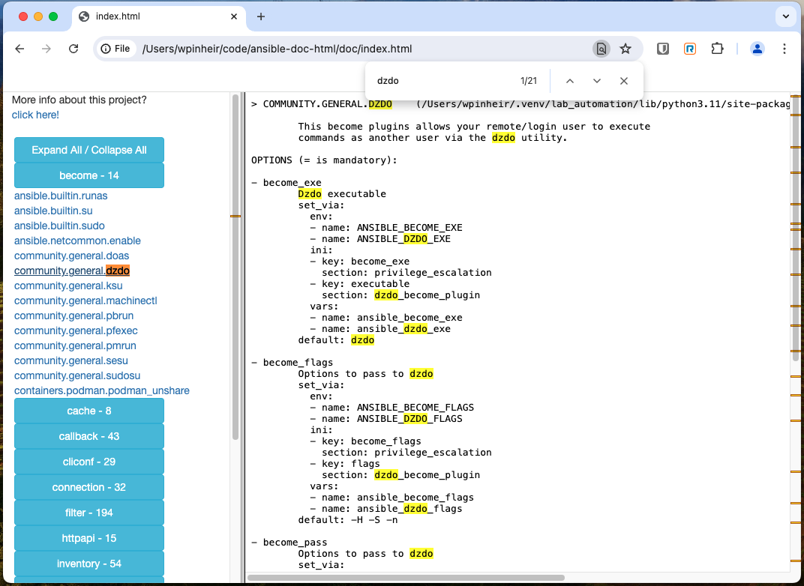

# ansible-doc-html

With the advent of Ansible, check the documentation it's something that we do all the time, and to be fair, ansible-doc it's an amazing command that helps a lot in this process. However, it's tedious if you would like to easily search all the availble types, in fact, you have to pass through them, via `CLI`, and that's ok.

Once I'm a good friend, I created this script, that will check all the types that you have in your environment, and will create a simple, but efficient webpage that you can access easily, copy and paste your code, just to simplify your life.

## Usage

Just download the bash, or clone the repo, as you wish, after that, you can simply execute it
```
./ansible-doc-html.sh
```

A directory named `doc` will be created, with a bunch of files, but the one that you need to open, is `index.html`. From there, you will be able to navigate, check all the documentation, search, copy and paste.




I hope you enjoy it, and please, feel free to submit issues to fix and/or improve it. I'll be more than glad to help!

Be safe!
Waldirio
